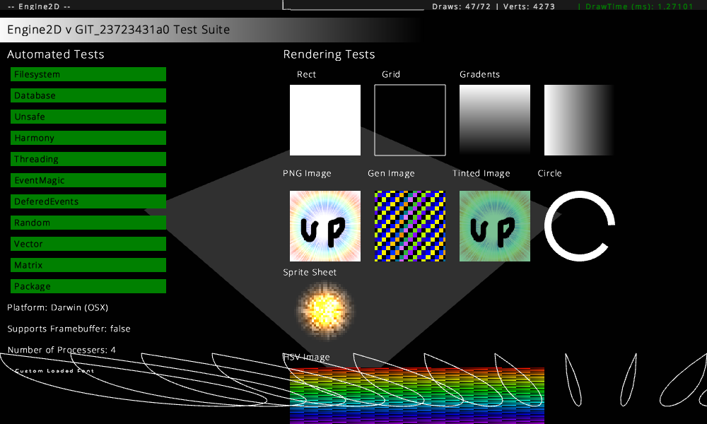

# "Engine2D" 2D Game Engine

[](https://travis-ci.org/Vbitz/Engine2D)

## Auto-Generated Screenshot


## What am I looking at?
Engine2D is a 2D Game Engine written in C++ with mature scripting support implemented using Chromium's V8 Javascript engine and graphics using OpenGL. Above is a screen shot of the interactive test suite testing Filesystem, Event dispatch among other core engine services.

## Building
Right now the engine builds out of the box on Mac OSX, Linux and Windows. To build it for other platforms you need...

- A modern C++ compiler supporting C++11. It's built using [clang](http://clang.llvm.org/) right now
- [Python](http://www.python.org/) v2.7.x (For GYP and tasks.py)
- [CMake](http://www.cmake.org/) (For GLFW)
- [GYP](https://code.google.com/p/gyp/)

On a source level you will need to fill in or stub out `Platform_{x}.cpp`.

Once you have the dependences installed you can run `./tasks.py build_env` and you will hopefully find a executable has been built.
You can run the built executable in devmode/debugmode (Profiler/DebugUI/Live-reloading/Verbose Console enabled) with `./tasks.py run`.

## Sample Code

Script located in `res/script/helloWorld.js`.

```javascript
sys.on("draw", "helloWorld.draw", function (e) {
	draw.setColor("blue");
	draw.rect(100, 100, 100, 100);
});
```

Engine2D's event system allows you to create connections between scripts and C++, `draw` is called each frame mid way though the rendering when everything is ready.

## Sample Code 2

Script located in `res/script/helloWorld2.js`.

```javascript
/* jshint esnext: true */

var counter = 0;
var circleColor = 0x101010;

function* genGradient() {
	while (true) {
		for (var x = 0; x < 360; x++) {
			yield draw.getRGBFromHSV(x, 1.0, 0.5);
		}
	}
}
var generator = genGradient();

setInterval(function () {
	circleColor = generator.next().value;
}, 100);

sys.on("draw", "helloWorld2.draw", function () {
	draw.setColor(circleColor);
	draw.rect(Math.sin(counter) * 100 + 150,
		Math.sin(counter) * 100 + 150, 100, 100);
	counter += sys.deltaTime + (Math.random() / 16);
});
```

Engine2D enables all ES6 features currently supported in V8 by default including but not limited to...
	- Classes
	- Generators
	- Block Scopeing (let)

## Documentation

The latest version of the documentation generated using JSDoc can be found under doc/apiDocs or hosted at [http://vbitz.com/public/EngineAPIDocs/](http://vbitz.com/public/EngineAPIDocs/).
Additional command line args that can be passed to the executable are documented under the `-h` executable flag or with the `engine_help` tasks.py task.

## Getting Started

- Run `build/Default/engine2D -devmode -debug script/helloWorld`.
- If you want to edit your script then just change the file and save, the engine reloads automatically if `-devmode` is enabled.

## Contributing
Code Contributions are welcome large and small. Issues with scripting, running or building the engine can be reported using the issue tracker to the right.

## License
Engine2D is licensed under the Apache 2 License. A copy can be found in LICENCE.
